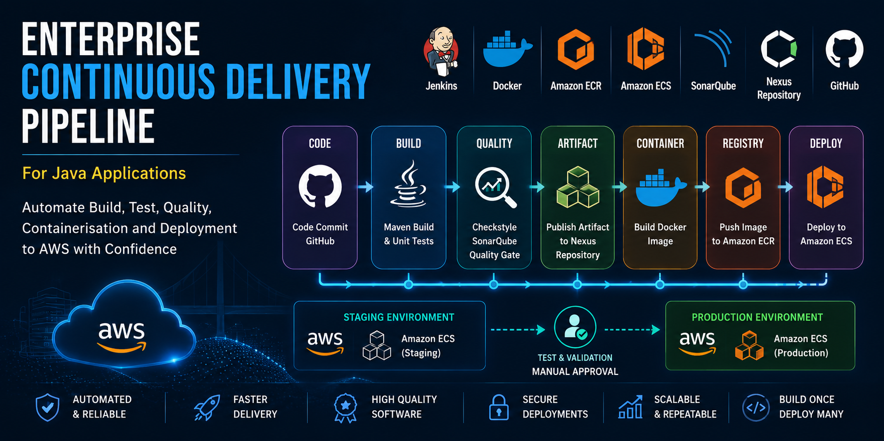
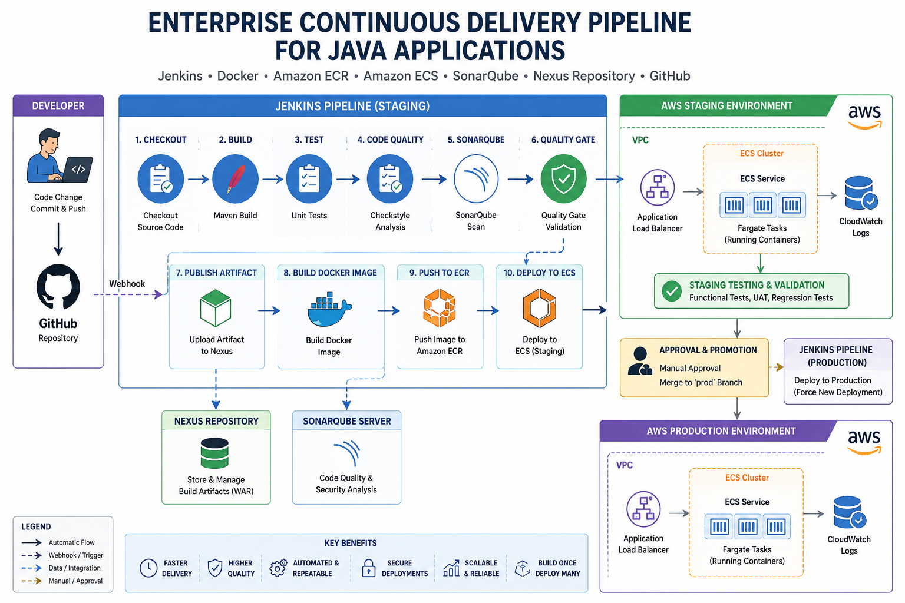

# Enterprise Continuous Delivery Pipeline for Java Applications Using Jenkins, Docker, Amazon ECR, Amazon ECS, SonarQube, Nexus Repository, and GitHub



## Table of Contents

1. Introduction
2. Project Objectives
3. Solution Architecture
4. Prerequisites
5. Architecture Overview
6. Implementation Steps

   * Step 1: Prepare the Continuous Integration Environment
   * Step 2: Prepare the Source Code Repository
   * Step 3: Configure AWS Resources
   * Step 4: Configure Jenkins
   * Step 5: Build and Publish Docker Images
   * Step 6: Deploy to Amazon ECS Staging
   * Step 7: Automate Staging Deployment
   * Step 8: Configure Production Deployment
   * Step 9: Validate the End-to-End Pipeline
7. CI/CD Workflow Summary
8. Best Practices
9. Troubleshooting
10. Conclusion

---

# 1. Introduction

Modern software delivery requires applications to be built, tested, containerised, and deployed rapidly while maintaining high quality and consistency. Continuous Delivery (CD) extends Continuous Integration (CI) by automatically delivering validated application releases to staging environments and preparing them for production deployment.

In this project, you will build an enterprise-grade Continuous Delivery pipeline for a Java web application using Jenkins, Maven, SonarQube, Nexus Repository, Docker, Amazon Elastic Container Registry (ECR), Amazon Elastic Container Service (ECS), GitHub, and AWS.

The completed solution automatically builds, tests, analyses, packages, containerises, publishes, and deploys a Java application to Amazon ECS. Separate staging and production pipelines ensure only validated application versions are promoted into production.

---

# 2. Project Objectives

By completing this project you will learn how to:

* Build an enterprise Continuous Delivery pipeline.
* Integrate GitHub with Jenkins using webhooks.
* Automate Java builds using Maven.
* Perform static code analysis using SonarQube.
* Store build artifacts in Nexus Repository.
* Containerise Java applications using Docker.
* Publish Docker images to Amazon ECR.
* Deploy containers to Amazon ECS.
* Automate staging deployments.
* Promote validated releases to production.
* Implement Build Once, Deploy Many deployment practices.

---

# 3. Solution Architecture

The solution integrates the following technologies.

| Component                 | Purpose                 |
| ------------------------- | ----------------------- |
| GitHub                    | Source Code Repository  |
| Jenkins                   | CI/CD Automation        |
| Maven                     | Build Tool              |
| SonarQube                 | Static Code Analysis    |
| Nexus Repository          | Artifact Repository     |
| Docker                    | Containerisation        |
| Amazon ECR                | Docker Registry         |
| Amazon ECS                | Container Orchestration |
| AWS IAM                   | Authentication          |
| AWS CLI                   | Deployment Automation   |
| Application Load Balancer | Traffic Distribution    |



---

# 4. Prerequisites

Before beginning the project ensure you have:

* AWS Account
* GitHub Account
* Jenkins Server
* Nexus Repository Server
* SonarQube Server
* Java JDK
* Maven
* Docker Engine
* AWS CLI
* Git
* Visual Studio Code
* SSH Key Pair

---

# 5. Architecture Overview

```
Developer
      │
      ▼
GitHub Repository
      │
      ▼
GitHub Webhook
      │
      ▼
Jenkins Pipeline
      │
      ├── Checkout Source
      ├── Maven Build
      ├── Unit Tests
      ├── Checkstyle
      ├── SonarQube Scan
      ├── Quality Gate
      ├── Publish Artifact
      ├── Build Docker Image
      ├── Push to Amazon ECR
      └── Deploy to Amazon ECS (Staging)
                     │
                     ▼
              User Acceptance Testing
                     │
             Manual Approval
                     │
                     ▼
           Production Jenkins Pipeline
                     │
                     ▼
         Deploy Existing Docker Image
                     │
                     ▼
            Amazon ECS Production
```

---

# Step 1 – Prepare the Continuous Integration Environment

Start the infrastructure created during the previous Continuous Integration project.

Required servers:

* Jenkins
* Nexus Repository
* SonarQube

After the EC2 instances start:

* Record the new public IP addresses.
* Update GitHub webhooks if necessary.

Verify the existing CI pipeline builds successfully before continuing.

---

# Step 2 – Update the GitHub Webhook

Navigate to:

```
GitHub
→ Repository
→ Settings
→ Webhooks
```

Update the webhook URL using the current Jenkins public IP.

Redeliver an existing webhook event to verify successful communication.

---

# Step 3 – Prepare the Repository

Create a new branch:

```bash
git checkout jenkins-ci
git checkout -b jenkins-ci-cd
```

Download or copy the Dockerfiles into the project.

Create two pipeline folders:

```
stage-pipeline/

prod-pipeline/
```

Copy the existing Jenkinsfile into each folder.

Remove the root Jenkinsfile.

Commit and push the new branch.

---

# Step 4 – Create Amazon ECR

Navigate to:

```
Amazon ECR
→ Repositories
```

Create a repository.

Example:

```
vprofile-app-img
```

This repository will store the Docker images produced by Jenkins.

---

# Step 5 – Create an IAM User

Create a dedicated Jenkins IAM user.

Attach:

* AmazonEC2ContainerRegistryFullAccess
* AmazonECS_FullAccess

Generate:

* Access Key
* Secret Access Key

Download the CSV file securely.

---

# Step 6 – Configure Jenkins

Install the following plugins:

* Docker Pipeline
* CloudBees Docker Build and Publish
* Amazon ECR
* Pipeline: AWS Steps

Store the AWS credentials:

```
Manage Jenkins
→ Credentials
→ Global
```

Install:

* AWS CLI
* Docker Engine

Grant Docker permissions:

```bash
sudo usermod -aG docker jenkins
sudo systemctl restart jenkins
```

Upgrade Jenkins to an instance size capable of building Docker images if necessary.

---

# Step 7 – Configure Docker Build

Review the multi-stage Dockerfile.

Stage 1:

* Clone repository
* Execute Maven build
* Produce WAR file

Stage 2:

* Create Tomcat runtime image
* Remove default applications
* Copy WAR
* Expose port 8080

Benefits:

* Smaller images
* Better security
* Faster deployments

---

# Step 8 – Build Docker Images

Update the staging Jenkinsfile.

Add variables:

* Registry credentials
* ECR repository URI
* Registry URL

Add a stage:

```
Build App Image
```

Build the image using:

* Docker Pipeline Plugin
* Jenkins Build Number as tag

---

# Step 9 – Publish Docker Images

Create a second pipeline stage.

```
Upload App Image
```

Authenticate to Amazon ECR.

Push:

* latest
* BUILD_NUMBER

Each build now creates a versioned Docker image.

---

# Step 10 – Create the Amazon ECS Staging Cluster

Create:

```
Amazon ECS Cluster
```

Use:

* AWS Fargate
* Linux
* Container Insights (optional)

---

# Step 11 – Create a Task Definition

Configure:

* Fargate
* 1 vCPU
* 2 GB Memory

Container:

* Image URI from ECR
* Port 8080

---

# Step 12 – Create the ECS Service

Create:

* ECS Service
* Application Load Balancer
* Target Group

Configure:

* Desired Tasks = 1
* Rolling Deployment

Create security groups allowing:

* HTTP 80
* Container Port 8080

Deploy the service.

Verify the application using the Load Balancer DNS.

---

# Step 13 – Automate Staging Deployment

Update the Jenkinsfile.

Add variables:

* Cluster Name
* Service Name

Add a deployment stage.

Use:

```bash
aws ecs update-service \
  --cluster <cluster> \
  --service <service> \
  --force-new-deployment
```

This forces ECS to deploy the newest Docker image.

---

# Step 14 – Enable GitHub Webhooks

Configure the Jenkins Pipeline.

Enable:

```
GitHub hook trigger for GITScm polling
```

Test by committing a small change.

The pipeline should automatically:

* Build
* Test
* Analyse
* Build Docker
* Push ECR
* Deploy ECS

---

# Step 15 – Configure Production

Create:

* Production ECS Cluster
* Production ECS Service
* Production Security Group
* Production Load Balancer

Reuse the existing Task Definition.

---

# Step 16 – Create the Production Branch

Create:

```bash
git checkout -b prod
git push origin prod
```

Switch to the production branch.

---

# Step 17 – Create the Production Pipeline

Configure:

```
prod-pipeline/Jenkinsfile
```

Unlike staging, the production pipeline only performs deployment.

It does **not**:

* Build
* Test
* Analyse
* Build Docker

Instead it deploys the validated Docker image already stored in Amazon ECR.

---

# Step 18 – Configure Jenkins Production Job

Create another Jenkins Pipeline.

Configure:

* Git Repository
* prod Branch
* Script Path

```
prod-pipeline/Jenkinsfile
```

Test by manually running the pipeline.

Verify deployment in the production ECS cluster.

---

# Step 19 – Validate the End-to-End Workflow

A complete release now follows this process:

```
Developer Commit
        │
        ▼
GitHub
        │
        ▼
Webhook
        │
        ▼
Jenkins Staging Pipeline
        │
        ├── Build
        ├── Test
        ├── SonarQube
        ├── Docker Build
        ├── Push ECR
        └── Deploy Staging
                    │
             User Acceptance Testing
                    │
             Manual Approval
                    │
          Merge into Production Branch
                    │
                    ▼
      Jenkins Production Pipeline
                    │
                    ▼
        Deploy Existing Docker Image
                    │
                    ▼
           Amazon ECS Production
```

---

# CI/CD Workflow Summary

The completed solution delivers:

* Automated source code checkout
* Maven compilation
* Unit testing
* Static code analysis
* Quality gate validation
* Artifact creation
* Docker image build
* Docker image publication
* Automated staging deployment
* Manual release approval
* Automated production deployment

---

# Best Practices

* Store secrets in Jenkins Credentials.
* Use dedicated IAM users for automation.
* Never deploy directly from feature branches.
* Use immutable Docker image tags.
* Promote the same Docker image through all environments.
* Protect production branches with pull requests and reviews.
* Keep staging and production pipelines separate.
* Monitor ECS deployments with CloudWatch and Container Insights.
* Use rolling or blue/green deployment strategies to minimise downtime.

---

# Troubleshooting

| Issue                          | Resolution                                                                                       |
| ------------------------------ | ------------------------------------------------------------------------------------------------ |
| GitHub webhook not triggering  | Verify webhook URL, Jenkins public IP, and firewall/security group rules.                        |
| Docker permission denied       | Add the `jenkins` user to the `docker` group and restart Jenkins.                                |
| ECR authentication failure     | Check IAM permissions, AWS credentials, and AWS region configuration.                            |
| ECS service not updating       | Verify cluster and service names, and ensure `--force-new-deployment` is used.                   |
| Container unhealthy            | Review ECS task logs, health check configuration, and dependent services (e.g. RabbitMQ, MySQL). |
| Jenkins pipeline syntax errors | Validate the `Jenkinsfile` syntax and confirm plugin compatibility.                              |

---

# Conclusion

This project demonstrates the implementation of a production-ready Continuous Delivery pipeline for Java applications using modern DevOps tools and AWS services. By integrating GitHub, Jenkins, Maven, SonarQube, Nexus Repository, Docker, Amazon ECR, and Amazon ECS, the pipeline automates the complete software delivery lifecycle—from code commit through testing, containerisation, deployment to staging, and controlled promotion to production. Following the **build once, deploy many** principle ensures that the exact same validated Docker image is promoted across environments, improving consistency, traceability, and deployment reliability while reflecting enterprise DevOps best practices.
